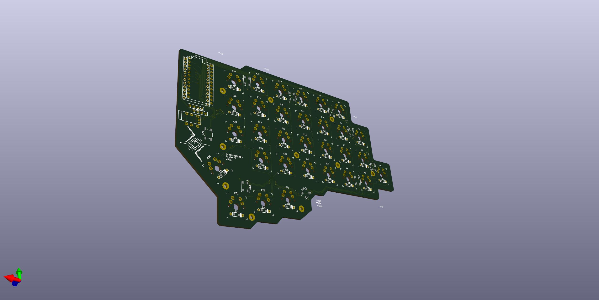
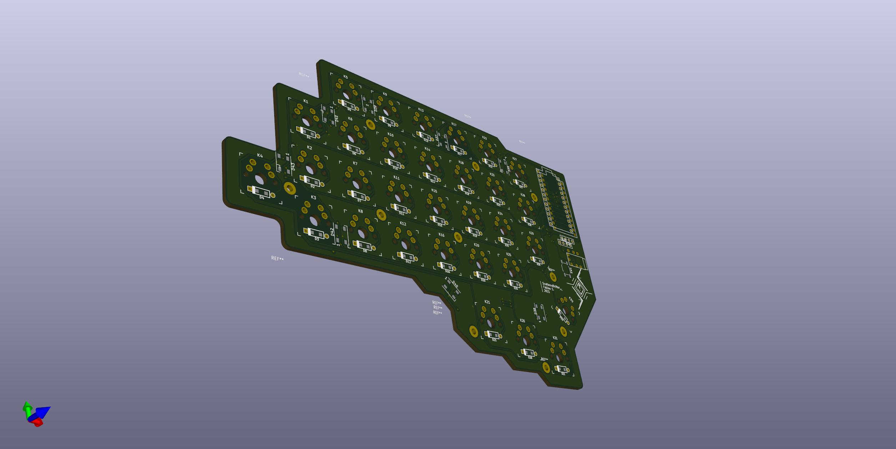

# Crystal-Zeliska
---

**Created and designed by: Fabian.S || ScatteredDrifter**

Welcome my first attempt to design a orthogonal split-keyboard. 

This is a 62-key-keyboard with 31 1u keys per side. 

The PCB was designed to be usable for both the left and right side. 

## Features: 
 - offers OLED - SSD1306 - display support, at least in theory **#** *haven't tested it yet* 
 - eight ws2812b mounted RGB LEds for underglow around the keyboard
 - included files for bottom and top-plate for FR4 skeleton mounting method
 
 
## Planned Features: 

- QMK support
- updated PCB with support pimoroni trackball 
- support for rotary encoder 
- acrylic stand offs for pro micros **#** *needs revision of pcb design*
- battery mount and charging circuit on pcb / or on smaller additional pcb
- 3d printable case | -  flat / high  **#** *add support for tenting*
 

## Images: 

**Right side of PCB**

**Left side of PCB**

---

**|| - Glory To mankind**
